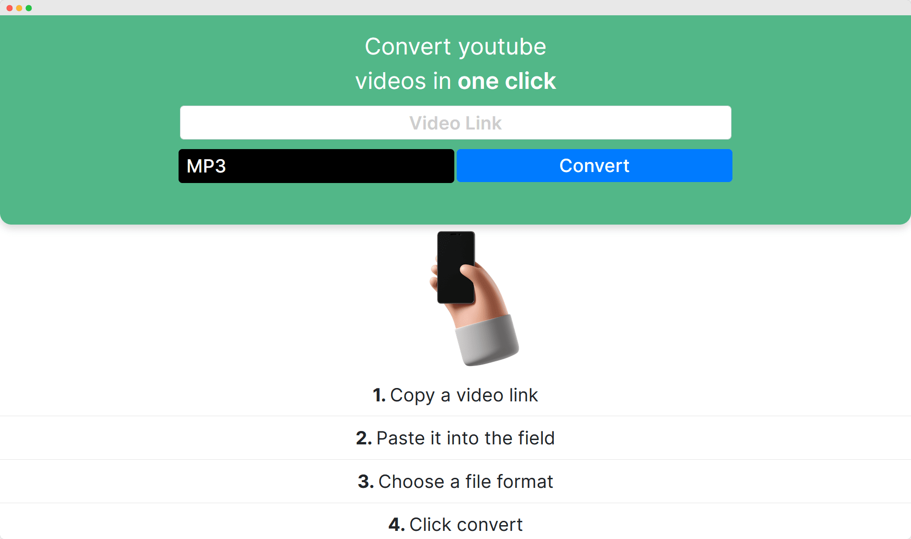

# Flask Youtube Converter
A full stack flask/python youtube video/audio converter



## ⏰ Getting Started

These instructions will get you a copy of the project up and running on your local machine for development and testing purposes. The cronjob.py file lets you delete downloaded media that are older than 5 mins (changeable).

###  Prerequisites / Dependencies

What things you need to install the software and how to install them

```
flask>=1.1.2
pytube>=10.0.0
```
###  Installing

A step by step series of examples that tell you how to get a development env running

1. Installing virtualenv

```
pip install virtualenv
```

2. Create venv

```
virtualenv venv
```

3. Activate virtualenv

Windows
```
.\path\venv\scripts\activate
```
Linux
```
$ source \path\venv\bin\activate
```

4. Install Packages
```
pip install flask
pip install pytube
```

## 🦺 Frontend built with
* [Bootstrap](getbootstrap.com/)
* HTML5
* CSS3

## ✌ Authors

* **Fabian Sefranek**

## 🧾 License

This project is licensed under the MIT License - see the [LICENSE.md](LICENSE) file for details
